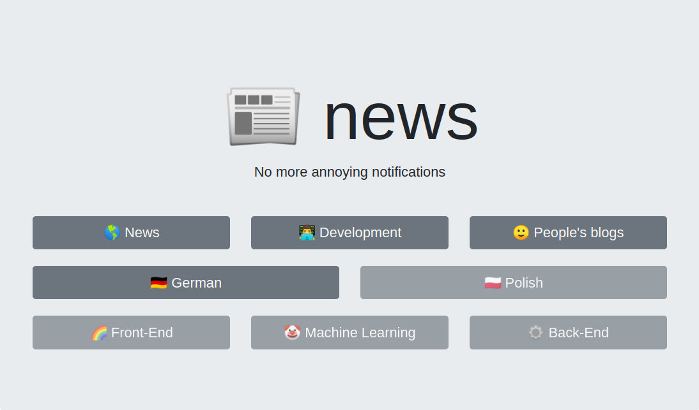
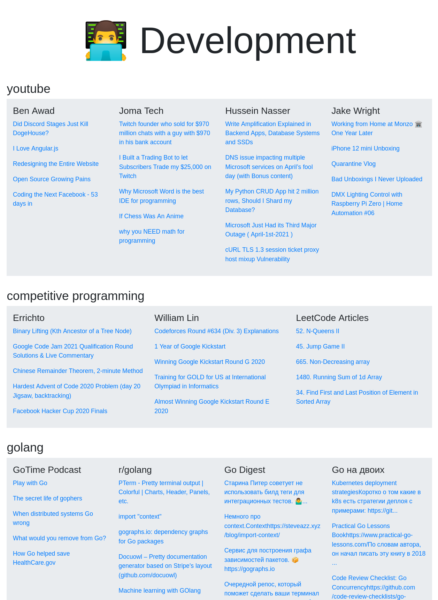
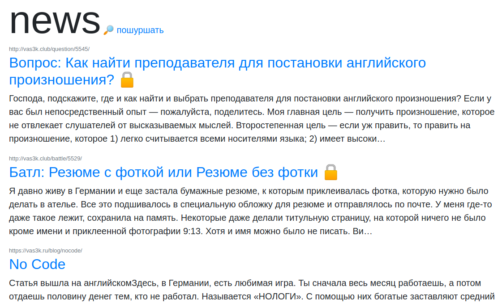

# news

Collect news from different sources in just one place. Simple, not perfect, and in progress. It's not even deployed yet!

How it looks now:

How it looks a half year ago:

Inspired by [infomate.club](https://infomate.club/).
